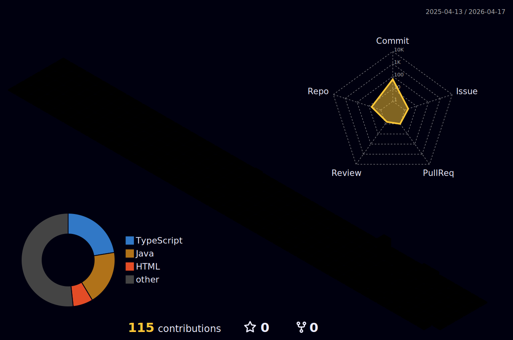

  

  

  
  
  
  

  

  

  

  

  

  
  
  
  
  
  

  

  

  

  

  

  
  

  
  

  

  

  

  <picture>
    <source media="(prefers-color-scheme: dark)" srcset="https://raw.githubusercontent.com/katakarn/katakarn/output/github-contribution-grid-snake-dark.svg" />
    <source media="(prefers-color-scheme: light)" srcset="https://raw.githubusercontent.com/katakarn/katakarn/output/github-contribution-grid-snake.svg" />
    
  </picture>

  

  

  

  

  

  
  

  
<b>Power-up Switches</b>

   
  To enable every dynamic module, add repository secrets:
   
  <code>METRICS_TOKEN</code> for metrics generation.
   
  <code>WAKATIME_API_KEY</code> for WakaTime panel.

